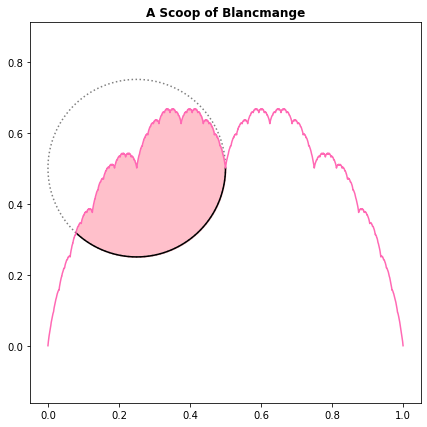

# Problem 226 Solution

## The Problem

The blancmange curve is the set of points $(x,y)$ such that $0 \le x \le 1$ and $y = {\sum_{n=0}}^{\infty} \frac{s(2^nx)}{2^n}$, where $s(x)$ is the distance from $x$ to the nearest integer. 

The area under the blancmange curve is equal to $\frac{1}{2}$, shown in pink in the diagram below.

Let $C$ be the circle with center $\frac{1}{4}, \frac{1}{2}$ and radius $\frac{1}{4}$, shown in black in the diagram. 

What area under the blacmange curve is enclosed by $C$?

[Source](https://projecteuler.net/problem=226)

## My Solution

Surprisingly easier than expected. I will not provide a direct solution for this Problem as I think it is worth solving on your own. As proof of completion here is a plot of the enclosed area I calculated using Python:

