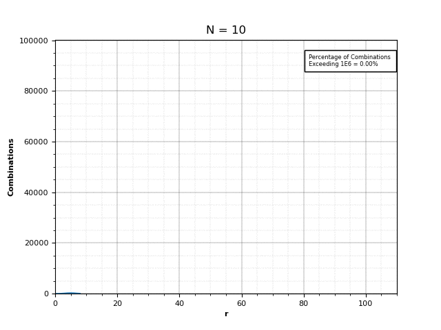

# Problem 53 Solution

## The Problem

There are exactly ten ways of selecting three from five, 12345:

123, 124, 125, 134, 135, 145, 234, 235, 245, and 345

In combinatorics, we use the notation, 
 = 10 

In general, 
 
!}) , where &space;\cdot&space;...&space;\cdot&space;3&space;\cdot&space;2&space;\cdot&space;1)

It is not until n = 23, that a value exceeds one-million:  = 1144066

How many, not necessarily distinct, values of   for  are greater than one-million?

[Source](https://projecteuler.net/problem=53)
## My Solution

This problem ask to find how many, not necessarily distinct, values of    for   are greater than one-million. It is not until n = 23 that a value exceeds a one-million threshold. (23,10) = 1,144,066 For this reason we can reduce our range of n to  

Now we can solve this problem using the combination formula !}).

But instead I used a reverse factorial formula to solve the combinations faster as seen in function ```reverse_factorial```. My motivation for this approach was to avoid large numbers in the numerator or denominator which can contribute to slower calculation times. I made a gif to illustrate how quickly sets of  will begin to exceed our one-million threshold. 



As soon as we approach n=23 the combination results easily surpass our threshold of one-million. It is interesting to see the combination results shift with new sets of   and how the percentage of one-million combinations slowly increases as you move up in n values. 


