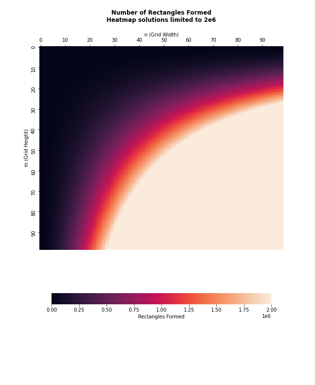
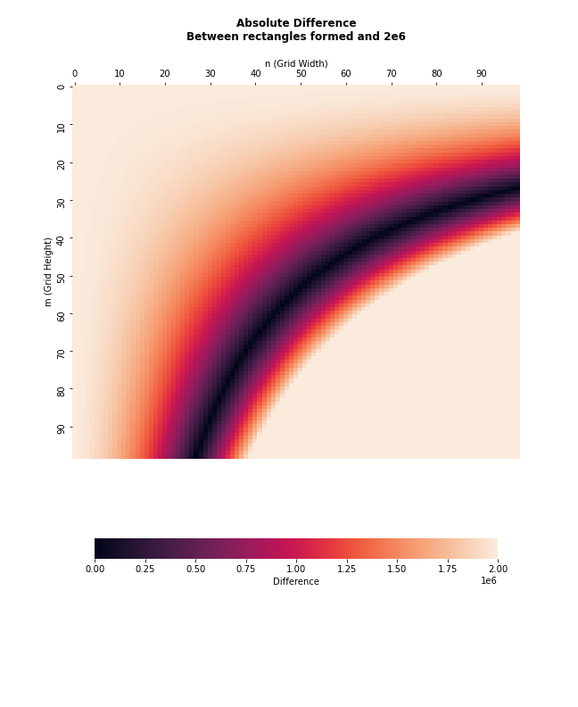

# Problem 85 Solution

## The Problem

By counting carefully it can be seen that a rectangular grid measuring 3 by 2 contains eighteen rectangles:

Although there exists no rectangular grid that contains exactly two million rectangles, find the area of the grid with the nearest solution.

[Source](https://projecteuler.net/problem=85)

## My Solution

### Formula

As an example, consider a one-dimensional Mx1 grid. The number of rectangles which can be formed are shown in the table below:
|M | Rectangles|
|--|------------|
|1 |1|
|2 |3|
|3 |6|
|4 |10|
|5 |15|

To form a rectangle we need two vertical and two horizontal lines. A MxN grid has M+1 horizontal lines and N+1 vertical lines. This example has a combinatronic solution when we choose to pick 2 vertical lines from set M+1.

The same can be shown for a one-dimensional 1xN grid, The combinatoric solution is:

Now for a two-dimensional grid multiply these two solutions to determine how many rectangles can be formed in a MxN grid:

(N^{2}&plus;N)}{4})

### Calculation
In this solution, I utilized Numpy’s ability to [broadcast](https://numpy.org/devdocs/user/theory.broadcasting.html) two one-dimensional arrays. Where the first row contains a range of N values and the first column contains a range of M values. The result is a two-dimensional array containing the number of rectangles formed for a sweep of MxN combinations. A similar array was created calculating the MxN grid area. 

The final step is to find the indices where the rectangle number is closest to 2,000,000 and index the grid area array with that information. The heatmaps below illustrate how various combinations of MxN grids approach 2,000,000 rectangles.

