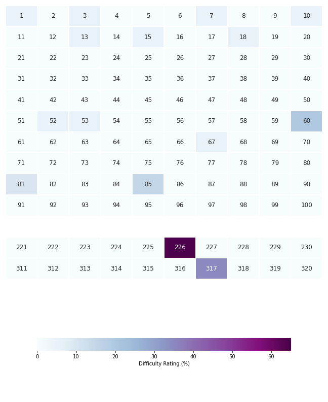

# Project Euler

Hello! This is a repo containing my solutions to various [Project Euler](https://projecteuler.net/about) problems. [I am an engineer](https://www.linkedin.com/in/eduardo-ocampo) and do not have a strong programming or mathematical background. However, puzzles have always interested me. I grew up trying to solve Hanayama metal puzzles or thinking endlessly about riddles. What I like about Project Euler is the variety of puzzles they host. Some which require a clever use of data structures. My language of choice for this is **Python**.  

I want to use this platform to provide the scripts, and thought process I used to problem solve. The goal is not to provide anyone with solutions they can use. Some of these puzzles took me a while to solve. I hope if you are here it's to view my portfolio and not to deprive yourself of a "Eureka!" moment.

# Progress

Below is a grid I created to illustrate which problems I have solved and their level of difficulty. My initial goal was to solve as many of the first 100 problems as possible. However, sometimes I stumble upon a more recent problem that intrigues me. A great example of this is Problem 317 which takes a classic physics problem and asks us to solve it using numerical methods. 

The highest difficulty solved is **35%**.

Accounting for all **7** problems I have solved, the average difficulty is **10.00%**
